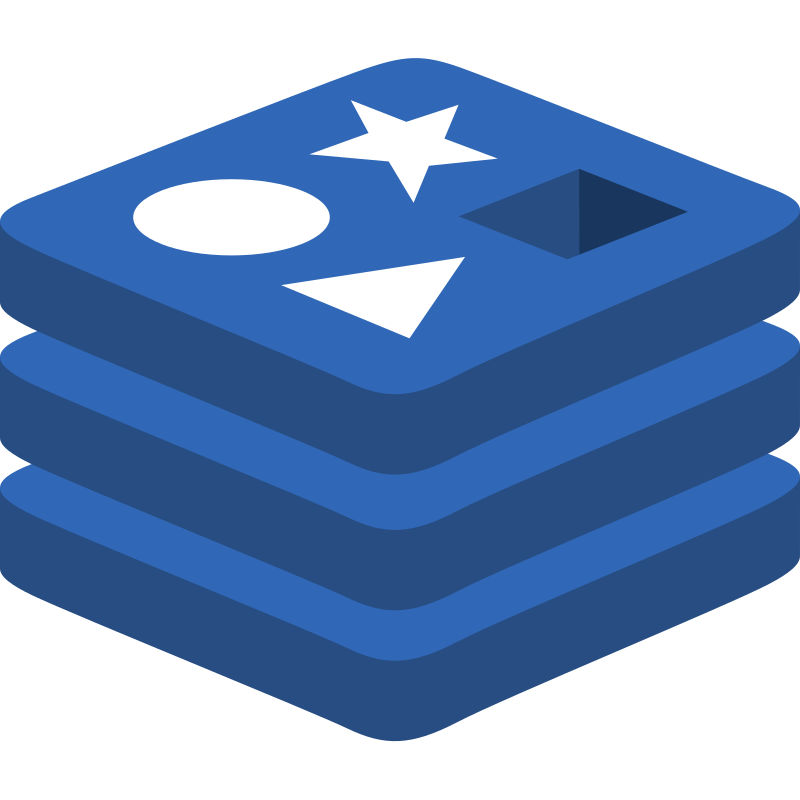

<div align="center">
  
  <h1>zod-redis</h1>
  <h3>Typesafe Redis storage made easy.</h3>
</div>

## Introduction

Do you love the speed and simplicity of Redis but miss the autocompletion and peace of mind that comes with static typing in TypeScript? Built on top of [Zod](https://github.com/colinhacks/zod), zod-redis is a drop-in replacement for [ioredis](https://github.com/redis/ioredis) that'll help you skip the headache of keeping track of your data structures, stringifying/destringifying your payload, and remembering what you're storing under which key. Specify the schema once and get/set with peace of mind.

## Under development 🚧

This package is still under development and APIs are subject to frequent changes. Production use is not yet intended.

## Installation

Install zod-redis on npm using your favorite package manager:

```bash
npm install zod-redis
yarn add zod-redis
bun add zod-redis
pnpm add zod-redis
```

## Basic Usage

Create a zod-redis instance using the same constructor as ioredis by specifying an additional `schema` option:

```typescript
const zredis = new ZRedis(6379, '127.0.0.1', {
  schema: {
    birthday: {
      zod: z.date(),
      getKey: <T extends string>(userId: T) => {
        return `birthday:${userId}` as const;
      },
      expirationSeconds: 30,
    },
  },
});
```

Construct keys using custom input:

```typescript
const birthdayKey = zredis.model('birthday').getKey('12345');
//     ^? const birthdayKey: "birthday:12345"
```

Set values with full typesafe input verification:

```typescript
// Error: Argument of type '"birthday;12345"' is not assignable to parameter of type '`birthday:${string}`.
await zredis.model('birthday').set('birthday;12345', new Date(2015, 0, 5));

// Error: Argument of type 'string' is not assignable to parameter of type 'Date'.
await zredis.model('birthday').set(birthdayKey, '2023-10-08T00:36:30.104Z');

// Valid
await zredis.model('birthday').set(birthdayKey, new Date(2015, 0, 5));
```

Retrieve and use values with confidence:

```typescript
const result = await zredis.model('birthday').get(birthdayKey);
//     ^? const result: Date | null

console.log(result?.toDateString());
```

And skip the type theatrics whenever it suits you:

```typescript
await zredis.set('birthday:12345', 'this is not a date');

// Protected accessor returns null
const protectedResult = await zredis.model('birthday').get(birthdayKey);

// Returns 'this is not a date'
const rawResult = await zredis.get(birthdayKey);
```

## How it works

Zod-redis is a wrapper around the `ioredis` package and tested against the entire `ioredis` test suite. The `ZRedis` class extends `Redis` with an additional constructor option for passing in the schema and a `model` function which provides access to commands that operate on your schema models.

<!--
## Documentation

TODO: step by step setup instructions and full documentation of all functions
-->

## Contributing

Issues and pull requests are welcome. I'll review them as soon as possible!
